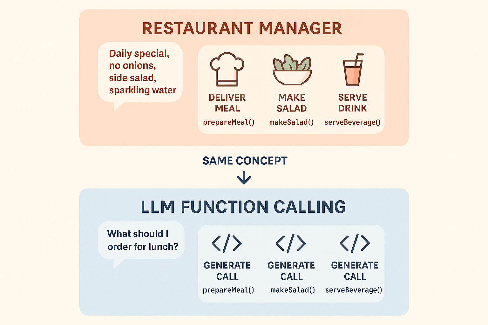
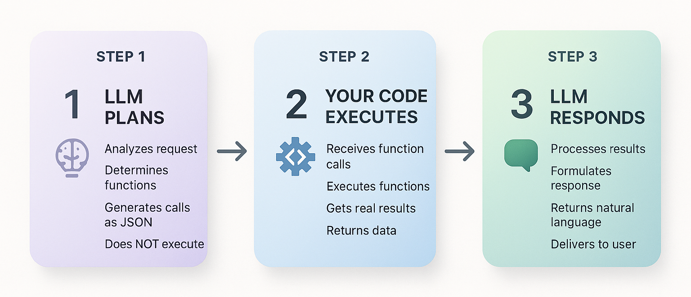
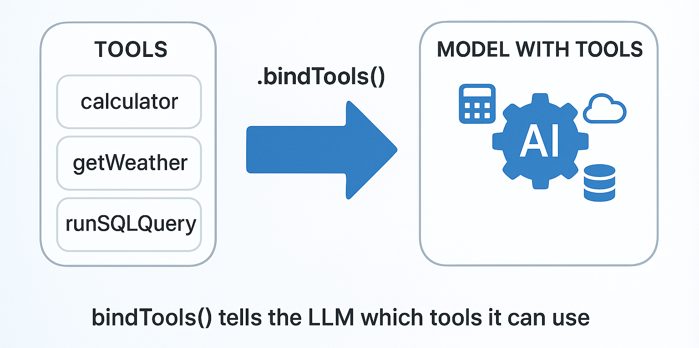
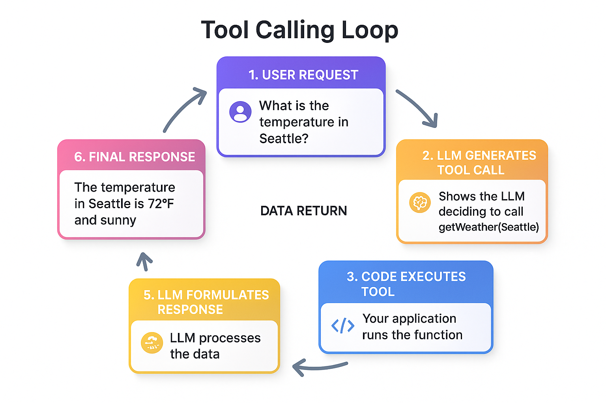
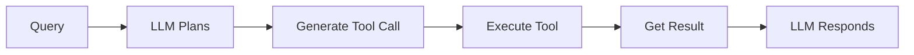

# Function Calling & Tools

In this lab, you'll learn how to extend AI capabilities beyond text generation by enabling function calling and tools. You'll discover how LLMs can invoke functions with structured arguments, create type-safe tools using Pydantic schemas, and build systems where AI can trigger real-world actions like API calls, database queries, or calculations.

**This is a foundational lab for building AI agents.** Tools are the building blocks that give agents their capabilities—without tools, agents are just text generators. In [Getting Started with Agents](../05-agents/README.md), you'll see how agents use the tools you create here to autonomously make decisions and solve multi-step problems.

## Prerequisites

- Completed [Prompts, Messages, and Structured Outputs](../03-prompts-messages-outputs/README.md)

##  Learning Objectives

By the end of this lab, you'll be able to:

-  Understand what function calling is and why it matters
-  Create tools with Pydantic schemas for type safety
-  Bind tools to chat models
-  Invoke tools and handle responses
-  Build systems with multiple tools
-  Apply best practices for tool design

---

##  About the Code Examples

The code snippets in this README are simplified for clarity. The actual code files in `code/` and `solution/` folders include:

-  **Enhanced error handling** with comprehensive try-except blocks
-  **Detailed console output** with step-by-step explanations and formatting
-  **Security best practices** including input sanitization and validation
-  **Educational comments** explaining the three-step execution pattern
-  **Additional examples** demonstrating edge cases and best practices

When you run the files, expect more detailed output and additional safeguards than shown in the simplified snippets below.

---

##  The Restaurant Staff Analogy

**Imagine you're a restaurant manager coordinating your team.**

When a customer orders "I'd like the daily special with no onions, a side salad, and sparkling water," you don't do everything yourself. Instead:

1. **You understand the request** (what they want)
2. **You delegate to specialists**:
   - ‍ Chef: "Make the daily special, no onions" (function: `prepare_meal`)
   -  Salad station: "Prepare a side salad" (function: `make_salad`)
   -  Bar: "Serve sparkling water" (function: `serve_beverage`)
3. **Each specialist confirms** what they're doing
4. **You coordinate the response** back to the customer

**Function calling in AI works exactly the same way!**

The LLM:
- **Understands** the user's request
- **Generates structured function calls** with proper arguments
- **Returns** the function details (but doesn't execute them)
- **Processes** the function results to form a response

The key: The LLM doesn't *do* the actions itself. Instead, it *describes* which functions to call and with what parameters. Your code executes them.



*Function calling works like a restaurant manager delegating to specialists - LLM generates function calls, your code executes them*

---

##  What is Function Calling?

[Function calling](../GLOSSARY.md#function-calling) transforms LLMs from text generators into action coordinators. Instead of just producing text, LLMs can trigger real-world operations—checking weather, querying databases, calling APIs, and more.

### The Paradigm Shift

**Before**: LLMs could only generate text. "What's the weather in Seattle?" → "I cannot access real-time weather data..."

**After**: LLMs can request external operations. "What's the weather in Seattle?" → LLM generates `{ "function": "get_weather", "args": { "city": "Seattle" } }`, your code executes it, LLM responds "It's currently 62°F and cloudy in Seattle."

### Understanding the Execution Model

**Critical concept: The LLM never executes functions directly.** Here's what actually happens:

**1. LLM's Role (Planning)**:
- Analyzes user request
- Determines which function(s) to call
- Generates structured function calls with arguments
- Returns this as JSON (doesn't execute anything)

**2. Your Code's Role (Doing)**:
- Receives function call descriptions
- Actually executes the functions
- Gets real results (API calls, calculations, etc.)
- Sends results back to LLM

**3. LLM's Role Again (Communicating)**:
- Incorporates function results into natural response
- Returns helpful answer to user

### Why This Separation Matters

**Security & Control**: Your code decides what functions exist and controls execution. You can reject dangerous operations.



*The 3-step execution model: LLM plans (generates calls), your code executes (does the work), LLM responds (natural language)*

**Example Flow**: "What's the weather in Tokyo and Paris?"
```python
# 1. LLM generates (doesn't execute):
{
    "tool_calls": [
        {"name": "get_weather", "args": {"city": "Tokyo"}},
        {"name": "get_weather", "args": {"city": "Paris"}}
    ]
}

# 2. Your code executes:
tokyo = get_weather("Tokyo")   # → "24°C, sunny"
paris = get_weather("Paris")   # → "18°C, rainy"

# 3. LLM responds:
"Tokyo is 24°C and sunny. Paris is 18°C and rainy."
```

### Key Characteristics

-  LLM generates function calls (describes what to do)
-  Your code executes functions (does the actual work)
-  You maintain control over security and validation
-  LLM handles reasoning about when to use functions

---

## ️ Creating Tools with the @tool Decorator

In LangChain Python, tools are created using the `@tool` decorator with Pydantic schemas for type safety.

If you're new to Pydantic, it's a Python library for data validation using Python type annotations. Think of it as a way to describe what valid input looks like—for example, "this parameter must be a string" or "this number must be between 1 and 100." Pydantic validates data at runtime and provides excellent type inference.

**You want to give your AI real-time calculator capabilities.** Without tools, the AI can only guess at calculations or say "I can't do math." With a calculator tool, the AI can recognize when a calculation is needed and request execution of the actual computation.

### Example 1: Simple Calculator Tool

Let's see how to create a tool using the `@tool` decorator with a Pydantic schema for type-safe parameters.

**Key code you'll work with:**

```python
# Define input schema with Pydantic
class CalculatorInput(BaseModel):
    expression: str = Field(description="The mathematical expression to evaluate")

# Define calculator tool using @tool decorator
@tool(args_schema=CalculatorInput)
def calculator(expression: str) -> str:
    """Useful for performing mathematical calculations."""
    result = eval(expression, {"__builtins__": {}}, {})
    return f"The result is: {result}"
```

**Code**: [`code/01_simple_tool.py`](./code/01_simple_tool.py)  
**Run**: `python 04-function-calling-tools/code/01_simple_tool.py`

**Example code:**

```python
from langchain_core.tools import tool
from pydantic import BaseModel, Field
from dotenv import load_dotenv

load_dotenv()

# Define input schema with Pydantic
class CalculatorInput(BaseModel):
    """Input schema for calculator tool."""
    expression: str = Field(
        description="The mathematical expression to evaluate, e.g., '25 * 4'"
    )

# Define calculator tool using @tool decorator
@tool(args_schema=CalculatorInput)
def calculator(expression: str) -> str:
    """Useful for performing mathematical calculations. 
    Use this when you need to compute numbers."""
    try:
        # Allow only safe mathematical operations
        allowed_names = {"abs": abs, "round": round, "min": min, "max": max}
        result = eval(expression, {"__builtins__": {}}, allowed_names)
        return f"The result is: {result}"
    except Exception as error:
        return f"Error evaluating expression: {error}"

def main():
    print("Tool created:", calculator.name)
    print("Description:", calculator.description)
    
    # Test the tool directly
    result = calculator.invoke({"expression": "25 * 4"})
    print("Result:", result)

if __name__ == "__main__":
    main()
```

### Expected Output

```text
Tool created: calculator
Description: Useful for performing mathematical calculations. Use this when you need to compute numbers.
Result: The result is: 100
```

### How It Works

**What's happening**:
1. **Define the input schema**: Pydantic `BaseModel` with `Field(description=...)` for parameters
2. **Create the tool**: Use `@tool(args_schema=...)` decorator to create the tool
3. **Implement the logic**: The function body contains the actual calculation
4. **Return result**: String describing the result

> **Security Note**: The code examples use `eval()` with restricted builtins. For production, use a proper math library like `simpleeval` or `mathjs` to prevent arbitrary code execution.

**Key Components**:
- **Implementation function**: What the tool actually does (`def calculator(expression):`)
- **Name**: How the LLM refers to the tool (`"calculator"`)
- **Description**: Helps the LLM decide when to use it (tells AI this is for math)
- **Schema**: Pydantic model defining parameters (`CalculatorInput`)

**Important**: At this stage, we've only *created* the tool. We haven't connected it to an LLM yet - that comes in Example 2!

---

##  Binding Tools to Models

Use `bind_tools()` to make tools available to the LLM.

**You've created a calculator tool, but how does the AI know it exists?** The tool sits in your code, disconnected from the AI. You need to tell the AI "here are the tools you can use" and let the AI decide when to call them. That's where `.bind_tools()` comes in—it connects tools to the model so the AI can intelligently choose when to use them.



*bind_tools() connects your tools to the model, making them available for the LLM to use*

### Example 2: Binding and Invoking Tools

Let's see how to use `.bind_tools()` to make tools available and observe how the AI generates structured `tool_calls`.

**Key code you'll work with:**

```python
# Create model and bind tools to it
model = ChatOpenAI(
    model=os.getenv("AI_MODEL"),
    base_url=os.getenv("AI_ENDPOINT"),
    api_key=os.getenv("AI_API_KEY"),
)

model_with_tools = model.bind_tools([calculator])  # Make tool available to LLM

# LLM generates tool call (doesn't execute!)
response = model_with_tools.invoke("What is 25 * 17?")
print(response.tool_calls)  # [{"name": "calculator", "args": {"expression": "25 * 17"}}]
```

**Code**: [`code/02_tool_calling.py`](./code/02_tool_calling.py)  
**Run**: `python 04-function-calling-tools/code/02_tool_calling.py`

**Example code:**

```python
from langchain_openai import ChatOpenAI
from langchain_core.tools import tool
from pydantic import BaseModel, Field
from dotenv import load_dotenv
import os

load_dotenv()

class CalculatorInput(BaseModel):
    expression: str = Field(description="Math expression to evaluate")

@tool(args_schema=CalculatorInput)
def calculator(expression: str) -> str:
    """Perform mathematical calculations."""
    result = eval(expression, {"__builtins__": {}}, {})
    return str(result)

def main():
    model = ChatOpenAI(
        model=os.getenv("AI_MODEL"),
        base_url=os.getenv("AI_ENDPOINT"),
        api_key=os.getenv("AI_API_KEY"),
    )

    # Bind tools to the model
    model_with_tools = model.bind_tools([calculator])

    # Invoke with a question
    response = model_with_tools.invoke("What is 25 * 17?")

    print("Response:", response)
    print("\nTool calls:", response.tool_calls)

if __name__ == "__main__":
    main()
```

### Expected Output

```text
 Asking: What is 25 * 17?

Tool calls: [
  {
    "name": "calculator",
    "args": {"expression": "25 * 17"},
    "id": "call_abc123"
  }
]
```

### How It Works

**What Happens**:
1. **LLM sees the tool description**: When we bind the calculator tool, the LLM learns about it
2. **LLM analyzes the query**: "What is 25 * 17?" → This needs the calculator tool
3. **LLM generates a tool call**: Returns structured data with tool name, arguments, and ID
4. **Your code receives the tool call**: `response.tool_calls[0]` contains the structured call
5. **Next step** (not shown here): You execute the tool with those arguments

**Important**: The LLM doesn't actually calculate anything! It only *describes* which tool to call and with what arguments. Your code must execute the tool (see Example 3).

---

##  Handling Tool Execution

### Example 3: Complete Tool Call Loop

In this example, you'll see the complete flow: LLM generates tool call, your code executes the tool, and results return to LLM for the final response.



*The complete cycle: user request → LLM generates call → code executes → result sent back → LLM responds*

**Key code you'll work with:**

```python
# Step 1: LLM generates tool call (Planning)
response1 = model_with_tools.invoke([HumanMessage(content=query)])
tool_call = response1.tool_calls[0]  # {"name": "get_weather", "args": {"city": "Seattle"}}

# Step 2: YOUR code executes the tool (Doing)
tool_result = get_weather.invoke(tool_call["args"])

# Step 3: Send result back to LLM (Communicating)
messages = [
    HumanMessage(content=query),
    AIMessage(content="", tool_calls=response1.tool_calls),
    ToolMessage(content=tool_result, tool_call_id=tool_call["id"]),
]
final_response = model.invoke(messages)  # "The current temperature in Seattle is 62°F..."
```

**Code**: [`code/03_tool_execution.py`](./code/03_tool_execution.py)  
**Run**: `python 04-function-calling-tools/code/03_tool_execution.py`

**Example code:**

```python
from langchain_openai import ChatOpenAI
from langchain_core.tools import tool
from langchain_core.messages import HumanMessage, AIMessage, ToolMessage
from pydantic import BaseModel, Field
from dotenv import load_dotenv
import os

load_dotenv()

class WeatherInput(BaseModel):
    city: str = Field(description="City name")

@tool(args_schema=WeatherInput)
def get_weather(city: str) -> str:
    """Get current weather for a city."""
    temps = {"Seattle": 62, "Paris": 18, "Tokyo": 24}
    temp = temps.get(city, 72)
    return f"Current temperature in {city}: {temp}°F"

def main():
    model = ChatOpenAI(
        model=os.getenv("AI_MODEL"),
        base_url=os.getenv("AI_ENDPOINT"),
        api_key=os.getenv("AI_API_KEY"),
    )

    model_with_tools = model.bind_tools([get_weather])

    # Step 1: Get tool call from LLM
    query = "What's the weather in Seattle?"
    response1 = model_with_tools.invoke(query)
    print("Step 1 - Tool call:", response1.tool_calls[0])

    # Step 2: Execute the tool
    tool_call = response1.tool_calls[0]
    tool_result = get_weather.invoke(tool_call["args"])
    print("Step 2 - Tool result:", tool_result)

    # Step 3: Send result back to LLM
    messages = [
        HumanMessage(content=query),
        AIMessage(content="", tool_calls=response1.tool_calls),
        ToolMessage(content=tool_result, tool_call_id=tool_call["id"]),
    ]

    final_response = model.invoke(messages)
    print("Step 3 - Final answer:", final_response.content)

if __name__ == "__main__":
    main()
```

### Expected Output

```text
User: What's the weather in Seattle?

Step 1: LLM generates tool call...
  Tool: get_weather
  Args: {'city': 'Seattle'}
  ID: call_abc123

Step 2: Executing tool...
  Result: Current temperature in Seattle: 62°F, partly cloudy

Step 3: Sending result back to LLM...

Final answer: The current temperature in Seattle is 62°F and it's partly cloudy.
```

### How It Works

**The Complete Flow**:
1. **Step 1 - LLM generates tool call**:
   - User asks "What's the weather in Seattle?"
   - LLM decides to use `get_weather` tool with `{"city": "Seattle"}`
2. **Step 2 - Execute the tool**:
   - Your code calls `get_weather.invoke(tool_call["args"])`
   - Tool returns: "Current temperature in Seattle: 62°F"
3. **Step 3 - Send result back to LLM**:
   - Build conversation history: user message + AI tool call + tool result
   - LLM receives the weather data
   - LLM generates natural language response: "The current temperature in Seattle is 62°F and it's partly cloudy."

**Key insight**: This three-step pattern (generate → execute → respond) is the core of function calling!

---

## ️ Multiple Tools

LLMs can choose from multiple tools based on the query.

**You're building an AI assistant that needs different capabilities—math calculations, web searches, and weather lookups.** Instead of creating separate AI instances or complex routing logic, you want one AI that intelligently chooses the right tool for each task. The AI should automatically pick the calculator for "What is 25 * 4?", search for "What's the capital of France?", and weather for "How's the weather in Tokyo?"

### Example 4: Multi-Tool System

Let's see how to bind multiple tools using `.bind_tools([tool1, tool2, tool3])` and let the AI choose which one to call.

**Key code you'll work with:**

```python
# Bind multiple tools - LLM automatically picks the right one
model_with_tools = model.bind_tools([calculator, search, get_weather])

queries = [
    "What is 125 * 8?",            # LLM chooses: calculator
    "What's the capital of France?", # LLM chooses: search
    "What's the weather in Tokyo?",  # LLM chooses: get_weather
]

for query in queries:
    response = model_with_tools.invoke(query)
    print(response.tool_calls[0]["name"])  # Shows which tool LLM selected
```

**Code**: [`code/04_multiple_tools.py`](./code/04_multiple_tools.py)  
**Run**: `python 04-function-calling-tools/code/04_multiple_tools.py`

**Example code:**

```python
from langchain_openai import ChatOpenAI
from langchain_core.tools import tool
from pydantic import BaseModel, Field
from dotenv import load_dotenv
import os

load_dotenv()

class CalculatorInput(BaseModel):
    expression: str = Field(description="Math expression")

class SearchInput(BaseModel):
    query: str = Field(description="Search query")

class WeatherInput(BaseModel):
    city: str = Field(description="City name")

@tool(args_schema=CalculatorInput)
def calculator(expression: str) -> str:
    """Perform mathematical calculations."""
    return str(eval(expression, {"__builtins__": {}}, {}))

@tool(args_schema=SearchInput)
def search(query: str) -> str:
    """Search for factual information."""
    results = {"capital of france": "Paris", "population of tokyo": "14 million"}
    return results.get(query.lower(), "No results found")

@tool(args_schema=WeatherInput)
def get_weather(city: str) -> str:
    """Get current weather for a city."""
    return f"Weather in {city}: 72°F, sunny"

def main():
    model = ChatOpenAI(
        model=os.getenv("AI_MODEL"),
        base_url=os.getenv("AI_ENDPOINT"),
        api_key=os.getenv("AI_API_KEY"),
    )

    model_with_tools = model.bind_tools([calculator, search, get_weather])

    queries = [
        "What is 125 * 8?",
        "What's the capital of France?",
        "What's the weather in Tokyo?",
    ]

    for query in queries:
        response = model_with_tools.invoke(query)
        if response.tool_calls:
            print(f"Query: {query}")
            print(f"  Tool: {response.tool_calls[0]['name']}")
            print()

if __name__ == "__main__":
    main()
```

### Expected Output

> **️ Note on Tool Calling Behavior:** Tool calling is probabilistic and varies by model. Some models may respond directly for simple queries (like math) instead of calling tools. The weather tool typically calls most consistently. To improve reliability, use more explicit prompts like "Use the calculator tool to compute..." or consider the `tool_choice` parameter.

```text
Query: "What is 125 * 8?"
  ️ May respond directly or call calculator tool

Query: "What's the capital of France?"
  ️ May respond directly or call search tool

Query: "What's the weather in Tokyo?"
  ✓ Chose tool: get_weather
  ✓ Args: {"city": "Tokyo"}
```

### How It Works

**What's happening**:
1. **Bind multiple tools**: All three tools (calculator, search, weather) are available to the LLM
2. **LLM reads tool descriptions**:
   - calculator: "Perform mathematical calculations"
   - search: "Search for factual information"
   - get_weather: "Get current weather"
3. **LLM chooses appropriate tool** for each query:
   - Math question → calculator
   - Factual question → search
   - Weather question → get_weather
4. **LLM generates correct arguments** for each tool

**Key insight**: The LLM automatically selects the right tool based on:
- Tool name
- Tool description
- Parameter schema
- The user's question

**Best practice**: Write clear, specific tool descriptions so the LLM can make the right choice!

---

##  Best Practices

### 1. Clear Tool Descriptions

```python
#  Poor
description = "Does weather stuff"

#  Good
description = "Get current weather for a specific city. Returns temperature, conditions, and humidity."
```

### 2. Descriptive Parameter Names

```python
#  Poor
class InputSchema(BaseModel):
    x: str
    y: int

#  Good
class WeatherInput(BaseModel):
    city: str = Field(description="The city name, e.g., 'Paris' or 'Tokyo'")
    units: Literal["celsius", "fahrenheit"] = Field(description="Temperature unit")
```

### 3. Error Handling

```python
@tool(args_schema=InputSchema)
def safe_tool(param: str) -> str:
    """Performs operation with error handling."""
    try:
        result = dangerous_operation(param)
        return result
    except Exception as error:
        return f"Error: {error}. Please try again with different parameters."
```

### 4. Validation

```python
class EmailInput(BaseModel):
    email: str = Field(description="Valid email address")
    subject: str = Field(min_length=1, description="Email subject")
    body: str = Field(description="Email body content")

@tool(args_schema=EmailInput)
def send_email(email: str, subject: str, body: str) -> str:
    """Send an email."""
    if "@" not in email:
        raise ValueError("Invalid email format")
    return f"Email sent to {email}"
```

---

## ️ Concept Map

This lab taught you the complete function calling workflow:



*The LLM plans, your code executes, and the LLM communicates the results.*

---

##  Progress Checkpoint

Before moving on, make sure you can:

| Skill | Check |
|-------|-------|
| Create tools with `@tool` decorator and Pydantic schemas |  |
| Bind tools to models with `bind_tools()` |  |
| Understand the 3-step execution pattern |  |
| Execute tools and send results back to LLM |  |
| Build multi-tool systems |  |
| Write clear tool descriptions |  |

---

##  Key Takeaways

- **Function calling** lets LLMs trigger real-world actions
- **LLMs generate** function calls, but don't execute them
- **Tools** are created with `@tool` decorator and Pydantic schemas
- **bind_tools()** makes tools available to the model
- **Type safety** with Pydantic prevents errors
- **Clear descriptions** help LLMs choose the right tool
- **Error handling** makes tools robust
- **Multiple tools** enable complex capabilities
- **Tools are the foundation for agents** - Next, you'll see how agents use tools to autonomously solve problems

---

##  Assignment

Ready to practice? Complete the challenges in [assignment.md](./assignment.md)!

The assignment includes:
1. **Weather Tool with Complete Execution Loop** - Build a weather tool and implement the complete 3-step execution pattern
2. **Multi-Tool Travel Assistant** (Bonus) - Build a system with multiple tools where the LLM automatically selects the appropriate tool

---

##  Additional Resources

- [Tool Calling Documentation](https://python.langchain.com/docs/how_to/tool_calling/)
- [Custom Tools Guide](https://python.langchain.com/docs/how_to/custom_tools/)
- [Pydantic Documentation](https://docs.pydantic.dev/)
