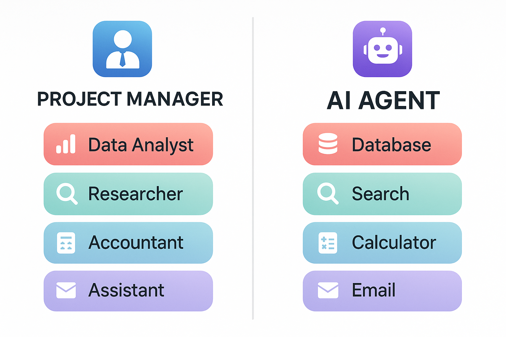
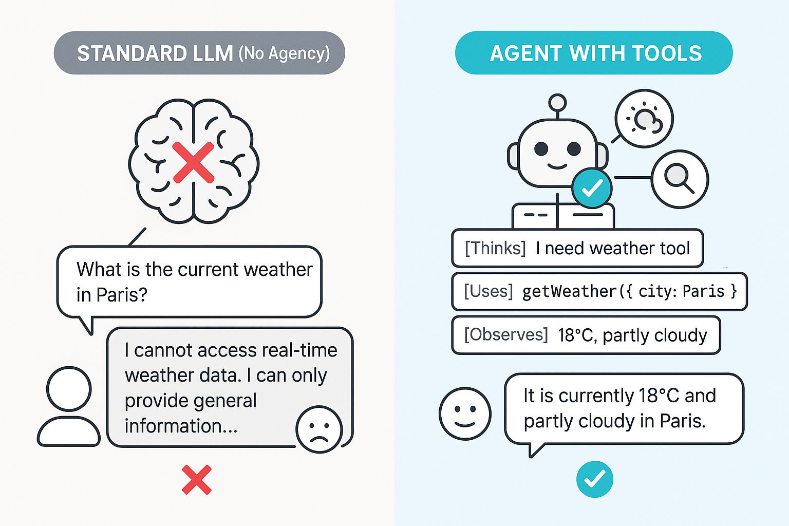
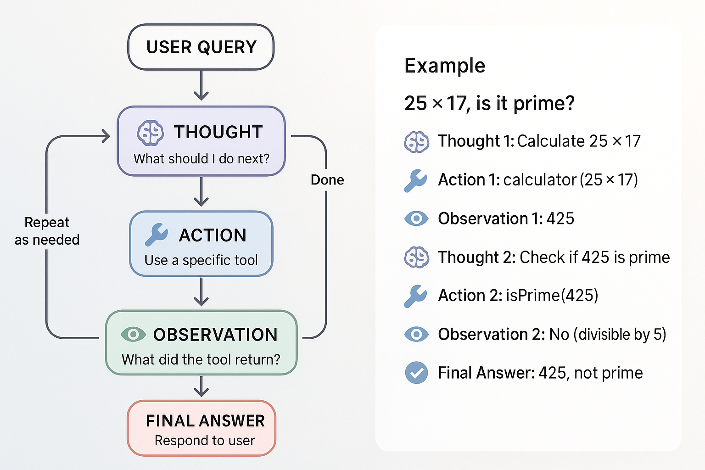
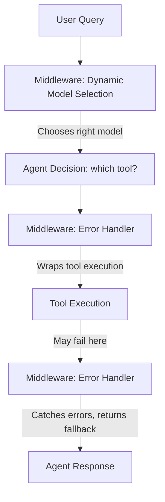
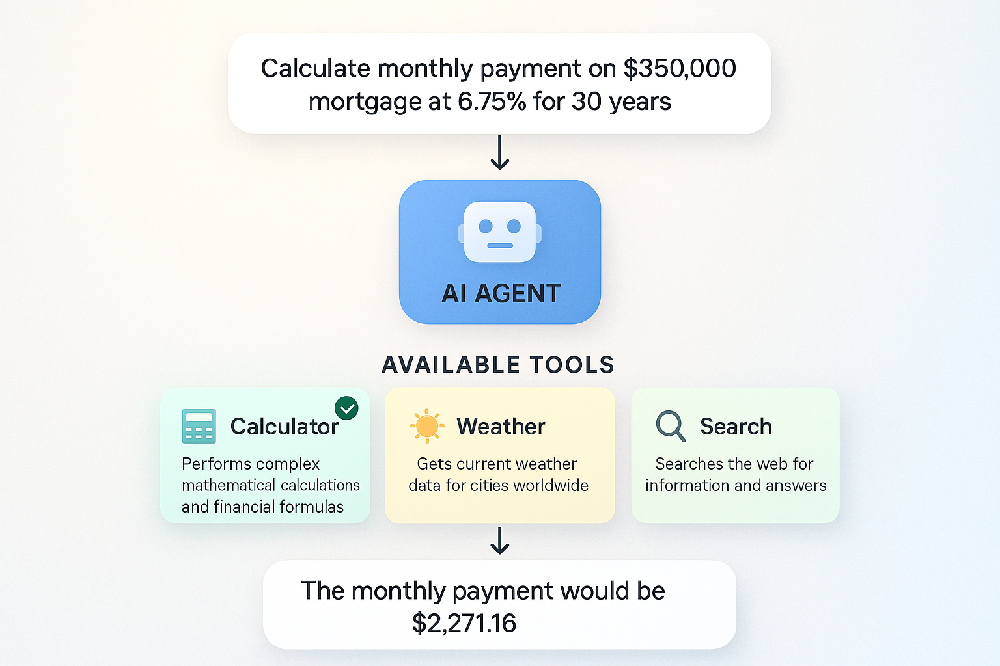
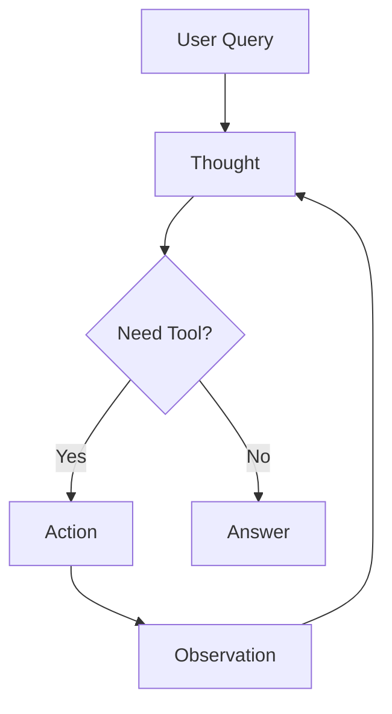

# Getting Started with Agents

In this lab, you'll learn to build AI agents that can reason about problems, select appropriate tools, and work iteratively towards solutions. You'll understand the ReAct (Reasoning + Acting) pattern by implementing agent loops step-by-step, and discover how agents autonomously choose tools to accomplish complex tasks. These skills enable you to build autonomous AI systems that can handle complex, multi-step tasks.

## Prerequisites

- Completed [Function Calling & Tools](../04-function-calling-tools/README.md)

##  Learning Objectives

By the end of this lab, you'll be able to:

-  Understand what AI agents are and how they work
-  Implement the ReAct (Reasoning + Acting) pattern
-  Build agent loops that iterate until solving a problem
-  Give agents multiple tools and let them choose the right one
-  Use create_agent() for production-ready agent systems
-  Implement middleware patterns for agent customization
-  Build multi-step, autonomous AI systems

---

##  The Manager with Specialists Analogy

**Imagine you're a project manager with a team of specialists:**

-  Data Analyst - can query databases
-  Researcher - can search the web
-  Accountant - can do calculations
- ️ Assistant - can send emails

When someone asks: *"What's our revenue growth this quarter compared to last year?"*

You (the manager) don't do everything yourself. You:
1. **Reason**: "I need data from the database and calculations"
2. **Act**: Ask the Data Analyst for revenue data
3. **Observe**: Review the data received
4. **Reason**: "Now I need to calculate the percentage change"
5. **Act**: Ask the Accountant to do the math
6. **Observe**: Get the calculated result
7. **Reason**: "Now I have the answer"
8. **Respond**: Give the final answer

**AI Agents work the same way!**

They:
- **Think** about what needs to be done (Reasoning)
- **Choose** the right tool (Decision Making)
- **Use** the tool (Acting)
- **Evaluate** the result (Observation)
- **Repeat** until they have the answer
- **Respond** to the user



*Both project managers and AI agents delegate tasks to specialists/tools, following the same iterative pattern.*

---

##  What Are Agents?

### Standard LLM (No Agency or Tools)

```
User: "What's the current weather in Paris?"
LLM: "I cannot access real-time weather data. I can only provide general information..."
```

### Agent with Tools

```
User: "What's the current weather in Paris?"
Agent: [Thinks] "I need to use the weather tool"
Agent: [Uses] get_weather(city="Paris")
Agent: [Observes] "18°C, partly cloudy"
Agent: [Responds] "It's currently 18°C and partly cloudy in Paris"
```



*Agents with tools can access real-time data and take actions, while standard LLMs are limited to their training data.*

---

##  The ReAct Pattern

ReAct = **Rea**soning + **Act**ing

Agents follow this iterative loop:

```
1. Thought: What should I do next?
2. Action: Use a specific tool
3. Observation: What did the tool return?
4. (Repeat 1-3 as needed)
5. Final Answer: Respond to the user
```

**Example**:
```
User: "Calculate 25 * 17, then tell me if it's a prime number"

Thought 1: I need to calculate 25 * 17
Action 1: calculator(expression="25 * 17")
Observation 1: 425

Thought 2: I need to check if 425 is prime
Action 2: is_prime(number=425)
Observation 2: False (divisible by 5)

Final Answer: "25 * 17 equals 425, which is not a prime number
because it's divisible by 5."
```



*The ReAct pattern: Agents iteratively reason about what to do, act by using tools, observe results, and repeat until they have the answer.*

---

##  Building Agents with create_agent()

LangChain Python provides `create_agent()` from `langchain.agents` - a high-level API that handles the ReAct loop automatically. This is the **recommended approach** for building production agents.

**What create_agent() does for you**:
-  Manages the ReAct loop (Thought → Action → Observation → Repeat)
-  Handles message history automatically
-  Implements iteration limits to prevent infinite loops
-  Provides production-ready error handling
-  Returns clean, structured responses

---

### Example 1: Basic Agent with create_agent()

Let's see how to use `create_agent()` to create an autonomous agent that handles the ReAct loop (Thought → Action → Observation) automatically.

**Key code you'll work with:**
```python
# Create agent using create_agent() - that's it!
agent = create_agent(
    model,
    tools=[calculator],  # Pass tools to the agent
)

# Use the agent with messages array
response = agent.invoke({"messages": [HumanMessage(content=query)]})

# Get the final answer from the last message
last_message = response["messages"][-1]
```

**Code**: [`code/01_create_agent_basic.py`](./code/01_create_agent_basic.py)  
**Run**: `python 05-agents/code/01_create_agent_basic.py`

**Example code:**

```python
from langchain.agents import create_agent
from langchain_core.tools import tool
from langchain_core.messages import HumanMessage
from dotenv import load_dotenv
import os

load_dotenv()

# Define a calculator tool for the agent
@tool
def calculator(expression: str) -> str:
    """A calculator that can perform basic arithmetic operations.
    
    Args:
        expression: The mathematical expression to evaluate
    """
    result = eval(expression, {"__builtins__": {}}, {})
    return str(result)

def main():
    # Create agent using create_agent() - that's it!
    agent = create_agent(
        model=os.getenv("AI_MODEL"),
        tools=[calculator],
        system_prompt="You are a helpful math assistant.",
    )

    # Use the agent with messages array
    query = "What is 125 * 8?"
    response = agent.invoke({
        "messages": [HumanMessage(content=query)]
    })

    # Get the final answer from the last message
    last_message = response["messages"][-1]
    print(f"Agent: {last_message.content}")

if __name__ == "__main__":
    main()
```

### Expected Output

```
 Agent with create_agent() Example

 User: What is 125 * 8?

 Agent: 125 × 8 = 1000

 Under the hood:
   create_agent() implements the ReAct pattern (Thought → Action → Observation)
   and handles all the boilerplate for you.
```

### How It Works

**What's happening behind the scenes**:
1. **Agent receives query**: "What is 125 * 8?"
2. **Reasons**: Determines it needs the calculator tool
3. **Acts**: Executes `calculator(expression="125 * 8")`
4. **Observes**: Gets result "1000"
5. **Responds**: Formats natural language response

---

### Example 2: create_agent() with Multiple Tools

Let's see how to give an agent multiple tools using `tools=[tool1, tool2, tool3]` and observe how it autonomously selects the right one.

**Key code you'll work with:**
```python
# Create agent with all three tools - agent auto-selects the right one
agent = create_agent(
    model,
    tools=[calculator, get_weather, search],  # Multiple tools!
)

# Agent automatically picks the correct tool for each query
queries = [
    "What is 50 * 25?",              # → Uses calculator
    "What's the weather in Tokyo?",  # → Uses get_weather
    "Tell me about LangChain",       # → Uses search
]
```

**Code**: [`code/02_create_agent_multi_tool.py`](./code/02_create_agent_multi_tool.py)  
**Run**: `python 05-agents/code/02_create_agent_multi_tool.py`

**Example code:**

```python
from langchain.agents import create_agent
from langchain_core.tools import tool
from langchain_core.messages import HumanMessage
from dotenv import load_dotenv
import os

load_dotenv()

@tool
def calculator(expression: str) -> str:
    """Perform mathematical calculations."""
    result = eval(expression, {"__builtins__": {}}, {})
    return str(result)

@tool
def get_weather(city: str) -> str:
    """Get the current weather for a city."""
    temps = {"Seattle": 62, "Paris": 18, "Tokyo": 24}
    temp = temps.get(city, 72)
    return f"Current weather in {city}: {temp}°F"

@tool
def search(query: str) -> str:
    """Search for information about a topic."""
    return f"LangChain is a Python framework for building AI applications with LLMs."

def main():
    # Create agent with all three tools
    agent = create_agent(
        model=os.getenv("AI_MODEL"),
        tools=[calculator, get_weather, search],
        system_prompt="You are a helpful assistant with access to multiple tools.",
    )

    # Agent automatically picks the correct tool for each query
    queries = [
        "What is 50 * 25?",              # → Uses calculator
        "What's the weather in Tokyo?",  # → Uses get_weather
        "Tell me about LangChain",       # → Uses search
    ]

    for query in queries:
        response = agent.invoke({
            "messages": [HumanMessage(content=query)]
        })
        last_message = response["messages"][-1]
        print(f"User: {query}")
        print(f"Agent: {last_message.content}\n")

if __name__ == "__main__":
    main()
```

### Expected Output

```
️  Multi-Tool Agent with create_agent()

 User: What is 50 * 25?
 Agent: 50 multiplied by 25 equals 1250.

 User: What's the weather in Tokyo?
 Agent: Current weather in Tokyo: 24°F

 User: Tell me about LangChain
 Agent: LangChain is a Python framework for building applications with large
language models (LLMs).

 What just happened:
   • The agent automatically selected the right tool for each query
   • Calculator for math (50 * 25)
   • Weather tool for Tokyo weather
   • Search tool for LangChain information
   • All with the same agent instance!
```

### How It Works

**What's happening**:
1. **Agent receives query**: "What is 50 * 25?"
2. **Reads tool descriptions**: Reviews all available tools
3. **Selects best match**: Calculator tool (description mentions "mathematical calculations")
4. **Executes tool**: Runs calculator with the expression
5. **Returns natural response**: Formats the result in natural language

**Tool Selection Logic**:
- The agent uses tool **names** and **descriptions** to match queries to tools
- More specific descriptions → Better tool selection
- The LLM decides which tool fits best based on semantic meaning
- You can give your agent multiple tools, and it will intelligently pick the right one for each task

---

### Example 3: Manual ReAct Loop (Understanding the Pattern)

To understand what `create_agent()` does under the hood, let's implement the ReAct loop manually.

**Code**: [`code/03_manual_react.py`](./code/03_manual_react.py)  
**Run**: `python 05-agents/code/03_manual_react.py`

**Example code:**

```python
from langchain_openai import ChatOpenAI
from langchain_core.tools import tool
from langchain_core.messages import HumanMessage, AIMessage, ToolMessage
from dotenv import load_dotenv
import os

load_dotenv()

@tool
def calculator(expression: str) -> str:
    """Perform mathematical calculations."""
    result = eval(expression, {"__builtins__": {}}, {})
    return str(result)

@tool
def is_prime(number: int) -> str:
    """Check if a number is prime."""
    if number < 2:
        return "False"
    for i in range(2, int(number ** 0.5) + 1):
        if number % i == 0:
            return f"False (divisible by {i})"
    return "True"

def run_react_loop(query: str, tools: list, max_iterations: int = 5):
    """Manually implement the ReAct loop."""
    
    model = ChatOpenAI(
        model=os.getenv("AI_MODEL"),
        base_url=os.getenv("AI_ENDPOINT"),
        api_key=os.getenv("AI_API_KEY")
    )
    
    # Create tool lookup
    tools_by_name = {t.name: t for t in tools}
    
    # Bind tools to model
    model_with_tools = model.bind_tools(tools)
    
    # Initialize messages
    messages = [HumanMessage(content=query)]
    
    for iteration in range(max_iterations):
        print(f"\n--- Iteration {iteration + 1} ---")
        
        # Step 1: Call the model
        response = model_with_tools.invoke(messages)
        messages.append(response)
        
        # Step 2: Check if there are tool calls
        if not response.tool_calls:
            print("No more tool calls - Final answer ready")
            return response.content
        
        # Step 3: Execute each tool call
        for tool_call in response.tool_calls:
            tool_name = tool_call["name"]
            tool_args = tool_call["args"]
            
            print(f"Action: {tool_name}({tool_args})")
            
            # Execute the tool
            tool_result = tools_by_name[tool_name].invoke(tool_args)
            print(f"Observation: {tool_result}")
            
            # Add tool result to messages
            messages.append(
                ToolMessage(content=str(tool_result), tool_call_id=tool_call["id"])
            )
    
    return "Max iterations reached"

def main():
    tools = [calculator, is_prime]
    
    query = "Calculate 25 * 17, then tell me if the result is a prime number"
    print(f"Query: {query}")
    
    result = run_react_loop(query, tools)
    print(f"\n Final Answer: {result}")

if __name__ == "__main__":
    main()
```

### Expected Output

```
Query: Calculate 25 * 17, then tell me if the result is a prime number

--- Iteration 1 ---
Action: calculator({'expression': '25 * 17'})
Observation: 425

--- Iteration 2 ---
Action: is_prime({'number': 425})
Observation: False (divisible by 5)

--- Iteration 3 ---
No more tool calls - Final answer ready

 Final Answer: 25 * 17 equals 425, which is not a prime number 
because it is divisible by 5.
```

---

##  Additional Agent Patterns

Now that you understand how to build basic agents with single and multiple tools, let's explore an additional pattern for production applications: **middleware**. Middleware lets you add behavior like logging, error handling, and dynamic model selection without modifying your tools or agent core logic.

### Example 4: create_agent() with Middleware

This example shows how to use **middleware** with `create_agent()` for production scenarios like dynamic model selection based on conversation complexity and graceful error handling.

**Key code you'll work with:**
```python
# Middleware intercepts agent behavior without changing tools
class DynamicModelMiddleware(AgentMiddleware):
    def wrap_model_call(self, request, handler):
        if len(request.state["messages"]) > 10:
            # Switch to more capable model for complex conversations
            return handler(request.override(model=advanced_model))
        return handler(request)

# Create agent with middleware - adds behavior like logging & error handling
agent = create_agent(
    model,
    tools=[calculator, search],
    middleware=[DynamicModelMiddleware(), ToolErrorMiddleware()],  # Plugin-style behavior!
)
```

**Code**: [`code/04_agent_with_middleware.py`](./code/04_agent_with_middleware.py)  
**Run**: `python 05-agents/code/04_agent_with_middleware.py`

**Example code:**

**What is middleware?** Middleware intercepts and modifies agent behavior without changing your tools or agent logic. Think of it as "plugins" for your agent.

```python
from langchain.agents import create_agent
from langchain.agents.middleware import AgentMiddleware, ModelRequest
from langchain.agents.middleware.types import ModelResponse
from langchain_core.messages import ToolMessage
from typing import Callable, Any

# Middleware 1: Dynamic Model Selection
# Switches to a more capable (and expensive) model for complex conversations
class DynamicModelMiddleware(AgentMiddleware):
    def __init__(self, messages_threshold: int = 10):
        super().__init__()
        self.messages_threshold = messages_threshold

    def wrap_model_call(
        self,
        request: ModelRequest,
        handler: Callable[[ModelRequest], ModelResponse],
    ) -> ModelResponse:
        message_count = len(request.state["messages"])
        print(f"  [Middleware] Message count: {message_count}")
        
        # Option for complex conversations (>threshold messages)
        if message_count > self.messages_threshold:
            print("  [Middleware] Switching to more capable model")
            # return handler(request.override(model=advanced_model))
        
        return handler(request)


# Middleware 2: Custom Error Handling
# Catches tool failures and provides helpful fallback messages
class ToolErrorMiddleware(AgentMiddleware):
    def wrap_tool_call(
        self,
        request: Any,
        handler: Callable[[Any], ToolMessage],
    ) -> ToolMessage:
        try:
            return handler(request)
        except Exception as e:
            tool_name = request.tool_call.get("name", "unknown")
            print(f"  [Middleware] Tool '{tool_name}' failed: {e}")
            # Return graceful fallback instead of crashing
            return ToolMessage(
                content=f"I encountered an error: {e}. Let me try a different approach.",
                tool_call_id=request.tool_call.get("id", ""),
            )


# Create agent with both middleware
agent = create_agent(
    model,
    tools=[calculator, search],
    middleware=[DynamicModelMiddleware(), ToolErrorMiddleware()]
)
```

### Expected Output

When you run `python 05-agents/code/04_agent_with_middleware.py`:

```
 Agent with Middleware Example

Test 1: Simple calculation
────────────────────────────────────────────────────────────
 User: What is 25 * 8?

  [Middleware] Message count: 1
  [Middleware] ✓ Using current model

 Agent: 25 multiplied by 8 equals 200.


Test 2: Search with error handling
────────────────────────────────────────────────────────────
 User: Search for information about error handling

  [Middleware] Message count: 1
  [Middleware] ✓ Using current model
  [Middleware] ️  Tool "search" failed: Search service temporarily unavailable
  [Middleware]  Returning fallback message

 Agent: I encountered an error while using the search tool. Let me try
a different approach to answer your question about error handling.

 Middleware Benefits:
   • Dynamic model selection → Cost optimization
   • Error handling → Graceful degradation
   • Logging → Easy debugging
   • Flexibility → Customize behavior without changing tools

 Production Use Cases:
   • Switch to cheaper models for simple queries
   • Automatic retries with exponential backoff
   • Request/response logging for monitoring
   • User context injection (auth, permissions)
   • Rate limiting and quota management
```

### How Middleware Works

**Middleware Flow**:


**Two Middleware Types**:

1. **wrap_model_call** - Intercepts calls TO the model
   - Dynamic model selection based on conversation length
   - Request logging and monitoring
   - Context injection (user permissions, session data)

2. **wrap_tool_call** - Intercepts tool executions
   - Error handling and retries
   - Tool result transformation
   - Permission checks before tool execution

**Production Benefits**:
-  **Cost Optimization**: Use cheap models for simple tasks, expensive for complex
-  **Resilience**: Graceful error handling prevents agent crashes
-  **Observability**: Log all requests for debugging and monitoring
-  **Flexibility**: Add behavior without modifying tools or agent core logic

**When to use middleware**:
- Production agents that need reliability
- Multi-tenant applications (different users, different permissions)
- Cost-sensitive applications
- Systems requiring audit logs

---

##  Tool Selection Logic

The agent uses tool **names** and **descriptions** to match queries to tools:

| User Query | Tool Selected | Why |
|-----------|---------------|-----|
| "What is 50 * 25?" | calculator | Matches "mathematical calculations" |
| "Weather in Tokyo?" | get_weather | Matches "weather for a city" |
| "Tell me about X" | search | Matches "search for information" |

**Tips for better tool selection**:
1. Use **descriptive names** - `get_weather` not `tool1`
2. Write **clear descriptions** - explain what the tool does
3. Document **parameters** - use docstrings with Args sections
4. Be **specific** - more detail helps the LLM choose correctly



*Agents intelligently select the right tool based on semantic matching between the query and tool descriptions.*

---

##  Key Takeaways

- **Agents make autonomous decisions** - They choose which tools to use and when
- **ReAct pattern is the core**: Reason → Act → Observe → Repeat until solved
- **create_agent() is production-ready** - Handles the ReAct loop automatically with built-in error handling
- **Tool descriptions matter** - Clear descriptions help agents pick the right tool
- **Middleware adds flexibility** - Plugin-style behavior for logging, error handling, dynamic model selection
- **Start simple, scale up** - Begin with basic agents, add middleware for production needs

---

## ️ Concept Map

This lab taught you how agents use the ReAct pattern for autonomous reasoning:



*Agents iterate (Think → Act → Observe) until they solve the problem.*

---

##  Assignment

Ready to practice? Complete the challenges in [assignment.md](./assignment.md)!

The assignment includes:
1. **Research Agent with ReAct Loop** - Build an agent from scratch that uses the ReAct pattern to answer questions
2. **Multi-Step Planning Agent** (Bonus) - Build an agent with multiple specialized tools that requires multi-step reasoning

---

##  Additional Resources

- [LangChain Agents Documentation](https://docs.langchain.com/oss/python/langchain/agents)
- [LangChain Middleware Guide](https://docs.langchain.com/oss/python/langchain/middleware/custom) - Custom middleware patterns
- [ReAct Paper](https://arxiv.org/abs/2210.03629) - Original research on Reasoning + Acting pattern
- [LangChain create_agent() API](https://docs.langchain.com/oss/python/releases/langchain-v1) - Official API reference

** Want to see manual agent implementations?** Check out the [`samples/`](./samples/) folder for:
- **Manual ReAct loop examples** - See how agents work under the hood without `create_agent()`
- **Step-by-step agent patterns** - Custom loop logic and detailed debugging
- These are great for understanding fundamentals before using `create_agent()`

### Project Ideas (So Far)

With what you've learned, you can build:
-  **Smart calculator** - Agent that knows when to use math vs search tools
- ️ **Weather assistant** - Agent that coordinates multiple data sources
-  **Task coordinator** - Agent that manages multiple tools for complex workflows
-  **Research helper** - Agent that combines calculation, search, and analysis tools

After completing the remaining labs, you'll add external service integration (MCP) and document search capabilities!

---

##  Troubleshooting

Common issues you might encounter when building agents:

### "Agent loops forever or hits max iterations"

**Cause**: Agent doesn't have a stopping condition or tools don't return useful results

**Fixes**:
1. Check your stopping condition:
```python
if not response.tool_calls or len(response.tool_calls) == 0:
    # Agent has finished - no more tools needed
    break
```

2. Lower `max_iterations` to fail fast during development:
```python
max_iterations = 3  # Start small, increase if needed
```

3. Ensure tools return meaningful results - vague outputs confuse the agent

### "Tool not found" error

**Cause**: Tool name mismatch between what LLM generates and what you defined

**Fix**: Verify the tool name exactly matches:
```python
@tool
def calculator(expression: str) -> str:  # Name must match exactly
    """Perform mathematical calculations."""
    # ...
```

### Agent makes wrong tool choices

**Cause**: Tool descriptions aren't clear enough

**Fix**: Improve tool descriptions with specific use cases:
```python
#  Vague
"""Does calculations"""

#  Clear
"""Perform mathematical calculations like addition, multiplication, percentages. 
Use this when you need to compute numbers."""
```

### Agent gets stuck repeating the same tool

**Cause**: Tool doesn't provide enough information for agent to progress

**Fix**: Ensure tool results are descriptive:
```python
#  Not helpful
return "42"

#  Descriptive
return "The calculation result is 42. This is the answer to 6 * 7."
```

---

##  Dependencies

Make sure you have the required packages:

```bash
pip install langchain langchain-openai python-dotenv
```
